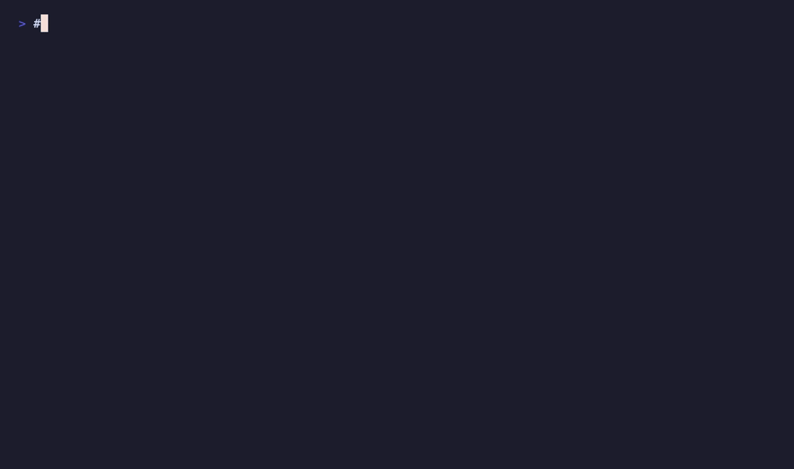

# Live Demos

These animated demonstrations show redisctl in action, highlighting key features and common workflows.

## Quick Start
Get up and running with redisctl in seconds.


## Profile Management
Manage authentication profiles for multiple Redis deployments.



## Redis Enterprise Operations
Working with Redis Enterprise clusters through the REST API.


## Redis Cloud Management
Managing Redis Cloud subscriptions, databases, and resources.


## Async Operations
Track long-running operations with progress indicators and customizable timeouts.


## Creating Your Own Demos

The demos above were created using [VHS](https://github.com/charmbracelet/vhs), a tool for creating terminal GIFs from scripts.

### Installation
```bash
# macOS
brew install vhs

# Linux/Windows
# See https://github.com/charmbracelet/vhs/releases
```

### Generating Demos
```bash
# Generate all demos
./vhs/generate-demos.sh

# Generate a specific demo
cd vhs
vhs profile-management.tape
```

### Creating Custom Demos
Create a `.tape` file with your commands:

```tape
# my-demo.tape
Output my-demo.gif
Set FontSize 16
Set Theme "Dracula"

Type "redisctl --version"
Enter
Sleep 2s
```

Then generate the GIF:
```bash
vhs my-demo.tape
```

See the [VHS documentation](https://github.com/charmbracelet/vhs) for more customization options.